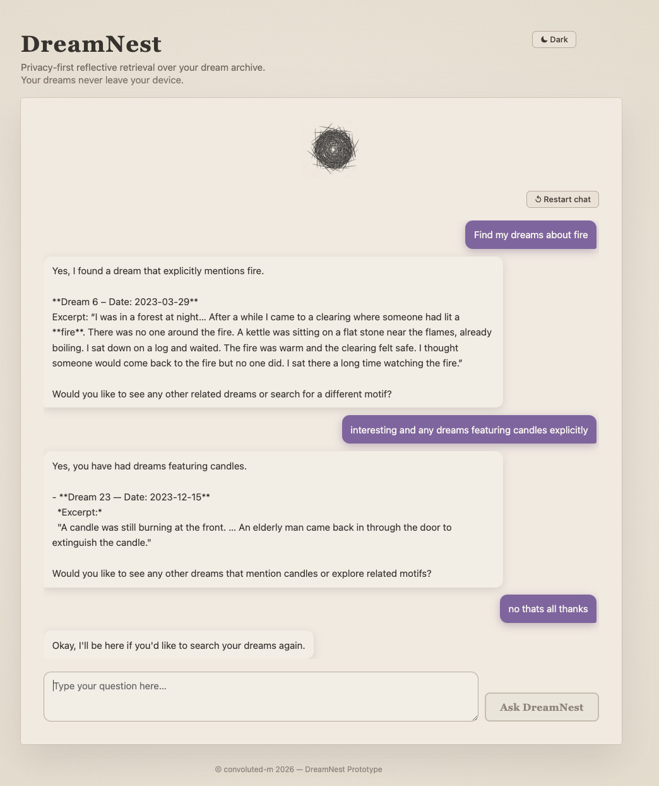

# DreamNest — Prototype

Privacy-first agentic RAG system for reflective dream exploration. Built with open-source models, run locally on the user's machine to preserve privacy. Built for the AI Makerspace AIE9 Certification Challenge.

## 1. Problem + Audience

This app is built for people like me who keep dream journals and want to search through them in an easy way to reflect on their dream life. Over months and years, one can end up with many notebooks full of recurring themes and be unable to connect the dots, to point to the exact dreams featuring specific patterns. It's hard to do it by hand, take my word. It should be easier than flipping through the pages of physical notebooks! If you ever wondered, *"When have I dreamt about fire?"* or *"Do I dream of flying yetis often?", you're not alone :). This app is a solution to this pain by providing grounded, descriptive answers to dream queries drawn only from the user's private dream archive. And because working with your intimate dream data should feel like a safe cosy space this app runs fully locally and the user's dream data is not to third-parties. Finally, I forml;y believe that dream analysis should preserves the user's agency in meaning-making. That's why this system focuses on descriptive retrieval,not interpretation - let's save that for actual analysis sessions and long dark night pondering. Welcome to your DreamNest.

The prototype supports queries like:

- `"Have I dreamt about fire?"` -> Searches for dreams containing fire and returns relevant dreams with dates/excerpts, if found
- `"Have I dreamt about whales?"` -> If no whale dreams are recorded, replies that no relevant dreams were found
- `"When have I dreamt about water?"` -> Aggregates and retrieves water-related dreams (e.g., lake, river, sea, pool)
- `"What recurring locations appear in my dreams?"` ->  summarises recurring locations across the dream archive
- `"What does dreaming about fire mean?"` -> Guardrail: declines interpretation and offers archive search instead
- `"What should I cook for dinner?"` -> Guardrail: for out of scope queries, redirects to dream-related ones
- `"Is it helpful to write down your dreams?"` -> uses  web search for general dreaming information (for certification challenge requirements)

## 2. Solution

DreamNest is an agentic RAG system built over the user's private dream journal. It features a minimal chat interface served locally in a browser. The flow is as follows: the user asks a question about their dreams --> The agent decides whether the query is about specific dreams (routes to the retrieval tool) or a general question about dreaming (routes to public web search). Agent responses are grounded only in retrieved content and focus on describing retrieved dream patterns. 

The stack is local-first with open-source LLM and embedding models running via Ollama, with Tavily as the single external API (used to satisfy certification challenge requirements).

```
User (browser)
     │
     ▼
Next.js frontend (localhost:3000)
     │  HTTP POST /api/chat
     ▼
FastAPI backend (localhost:8000)
     │
     ▼
LangChain agent orchestration   ◄────  create_agent(), SYSTEM_PROMPT (rules, guardrails, tool routing)
     │
     ├──► Qdrant vector store (in-memory)
     │    ◄── OllamaEmbeddings (embeddinggemma, local)
     │         │
     │         ├── Semantic retriever → dream_archive_search (Tool 1, baseline)
     │         │   cosine similarity search, score-based filtering
     │         │
     │         └── Hybrid retriever → dream_archive_search (Tool 1, upgraded)
     │             semantic search + BM25 lexical retrieval, fused with RRF
     │
     └──► tavily_dream_info (Tool 2 — public web search via Tavily API)
     │
     ▼
ChatOllama (gpt-oss:20b, local via Ollama)
     │  generates final response from tool output
     ▼
FastAPI → Next.js → User
```

Tooling choices:

- LLM — `gpt-oss:20b` via Ollama. Open-source, runs locally — no user data sent externally.
- Embedding model — `embeddinggemma` via Ollama. Open-source, lightweight model, runs locally - good semantic similarity for dream narration.
- Agent orchestration — LangChain `create_agent()`. Handles agentic RAG and tool routing.
  - Tool 1 — `dream_archive_search`. Retrieves from private dream archive using lexical + semantic retrieval.
  - Tool 2 — `tavily_dream_info`  via Tavily API. Handles general questions about dreaming and dream journaling.
- Vector database — Qdrant (in-memory) - fully local; sufficient for prototype.
- Backend — FastAPI . Lightweight Python API.
- Frontend — Next.js. Served locally on user's machine; minimal chat UI for prototype.
- Evaluation — RAGAS. Standard RAG evaluation framework with LLM as judge.
- Deployment — Local only as a privacy requirement — user data does not leave the device.

RAG components:
- Retriever: hybrid retriever combining Qdrant semantic search and BM25 lexical search, fused with reciprocal rank fusion (RRF)
- Generator: `ChatOllama (gpt-oss:20b)` summarises retrieved dream content into a response

Agent components:
- `create_agent()` agent with two tools decides whether and when to call each tool
- `SYSTEM_PROMPT` prompt with instructions, guardrails, tool routing rules and few-shot examples 

## 3. Data + Chunking

For the prototype, I generated 32 synthetic dream journal entries and saved them as a single PDF (`data/dream_entries.pdf`). Each entry includes a date and a first-person dream narrative (100–300 words). The entries feature recurring motifs (water, houses, bridges, clocks, trains) to support retrieval and pattern evaluation.

The document is split one dream entry per chunk, using `"Dream "` as the separator in `RecursiveCharacterTextSplitter`. Chunk overlap is set to 0. I made this decision because the unit of retrieval should be a complete dream entry (splitting a dream mid-narrative would break the coherence of the entry - bits of a single dream would appear in different chunks and could be retrieved independently, thus degrading retrieval precision and response quality). Using each dream as separate  keeps each retrieved chunk self-contained and meaningful.

I use  the Tavily Search API with the (`tavily_dream_info` tool) for general questions about dreaming and dream journaling (e.g. *"Is it helpful to keep a dream journal?"*). Tavily is not called for queries about the user's specific dreams. The tool is included in the prototype to meet the certification challenge requirements and I will probably remove it later as this exposes the app to the public web.

## 4. End-to-End Prototype

Full agent loop (LLM -> tool call -> retrieval -> LLM summarizes -> response) is implemented in the prototype:

- FastAPI backend (`api/index.py`) initialises the hybrid RAG pipeline and agent on startup
- LangChain `create_agent()` with two `@tool` functions handles user queries
- Next.js frontend (`frontend/`) provides a chat UI served at `localhost:3000`
- Public deployment was not implemented by design as this would violate the privacy-first assumption of this app.

Prototype UI screenshot:

<p align="center" draggable="false">
  
</p>

*DreamNest prototype UI showing an example of agentic retrieval in action.*

## 5. Evaluation

Evaluation was run using the RAGAS framework with LLM as a judge. 
I manually curated a golden test set (10 test cases ) covering key intended behaviours: positive retrieval (objects, motifs, animals), negative retrieval (no hallucination on absent terms), pattern aggregation, guardrail enforcement (interpretation refusal), and out-of-scope query handling.

I evaluated the pefromance on the following RAGAS metrics:

- Faithfulness — checks whether the answer stays grounded in retrieved context
- Answer Relevancy — checks whether the answer addresses the user question
- Context Precision — checks how much of retrieved context is actually useful
- Context Recall — checks whether relevant chunks were retrieved
- Noise Sensitivity — checks how much irrelevant retrieved context affects answer quality

Baseline semantic retriever performance:

| Metric | Score |
|---|---|
| Faithfulness | 0.4995 |
| Answer Relevancy | 0.3782 |
| Context Precision | 0.5000 |
| Context Recall | 0.3500 |
| Noise Sensitivity | 0.3699 |

NOTE: RAGAS LLM-as-judge evaluator is non-deterministic across runs and the results should be read in terms trends rather than absolute values.

## 6. Retriever Upgrade

The retriever was upgraded to hybrid retrieval (semantic + BM25 lexical retrieval + RRF fusion)

I did this because on the assumption that semantic similarity alone struggles with exact keyword queries. BM25 lexical search is strong at exact matches. Combining both approaches would improve recall for specific keyword queries while retaining semantic breadth for thematic ones.

Implementation:

- Semantic similarity search
- Lexical BM25 retriever 
- Fusion: Reciprocal Rank Fusion (RRF) returning top `k=3` chunks

Hybrid retriever performance:

| Metric | Baseline (semantic) | Hybrid (semantic + lexical) |
|---|---|---|
| Faithfulness | 0.4995 | 0.4958 |
| Answer Relevancy | 0.3782 | 0.3794 |
| Context Precision | 0.5000 | **0.6000** |
| Context Recall | 0.3500 | **0.4000** |
| Noise Sensitivity | 0.3699 | **0.2803** |

The hybrid retriever improved retrieval quality (`context_precision`, `context_recall`) and reduced noise sensitivity. However, faithfulness didn't improve, in  fact it dropped slightly.

Noise sensitivity improved from 0.3699 (baseline) to 0.2803 (hybrid). For `"Have I dreamt about whales?"`, retrieved contexts still included multiple water-related dreams that did not mention whales. This illustrates retrieval noise from semantic similarity.

## 7. Next Steps

- Try other retrieval strategies such as reranking with an open soucre model, if available (I didn't use the Cogere Reranker give my privacy concern)
- Try query-aware retrieval with as higher top-k for pattern/aggregation queries
- Explore theme extraction beyond keyword matching with, e.g. a classifier.
- Add timeline and dashboard views for recurring themes.
- Explore emotional-tone retrieval for richer reflection workflows, potentially with a classifier.
- Allow users to upload their own dream journal PDFs directly from the UI.
- Potetnially remove Tavily web search tool given it exposes the app to the web. 
- Assess better options in terms of performance on local hardware such as laptops specially for the vector storage options. I run the LLM inference on a private GPU since my laptop struggled but kept the vector store on my laptop and it felt heavy.
- Explore public corpora for demo data and training data for classifiers.
- Consider asking for feedback from the community when an improved version is built.

This app is a prototype so it has obviius limitaions. I was primarily copncerned with the pivacy-first local deployment but the prototype   uses Tavily to satisfy the certification challenges requirements. As mentioned before, the  prototype uses an in-memory Qdrant vector store and local model inference, which is resource-heavy and may be slow if using a laptop not GPU. This will be reviewed in future iterations.

## How to Run

### Repo layout
- `agent.py` — RAG pipeline, retrieval logic, tools, agent
- `api/index.py` — FastAPI backend
- `frontend/` — Next.js web UI
- `data/` — dream PDFs
- `evals/` — RAGAS evaluation notebook and results

### Prerequisites
- Python 3.11–3.12
- `uv` for dependency management
- Node.js (for frontend)
- Ollama for local model inference

### Setup

**1. Install Python dependencies**
```bash
uv sync
```

**2. Install frontend dependencies**
```bash
cd frontend && npm install
```

**3. Pull required Ollama models**
```bash
ollama pull gpt-oss:20b      # chat model (~13GB); substitute llama3.2:3b (~2GB)
ollama pull embeddinggemma   # embedding model (~622MB)
```

**4. Set environment variables**

Create a `.env` file at project root:
```
OPENAI_API_KEY=...   # required for RAGAS evaluation only
TAVILY_API_KEY=...   # required for Tavily web search tool
```

### Run locally

**Terminal 1 — start Ollama:**
```bash
ollama serve
```

**Terminal 2 — start FastAPI backend:**
```bash
uv run uvicorn api.index:app --reload
```

**Terminal 3 — start frontend:**
```bash
cd frontend && npm run dev
```

Open `http://localhost:3000` in your browser.

**Test endpoints:**
```bash
curl http://localhost:8000/api/health

curl -X POST http://localhost:8000/api/chat \
  -H "Content-Type: application/json" \
  -d '{"question": "Have I dreamt about fire?"}'
```
